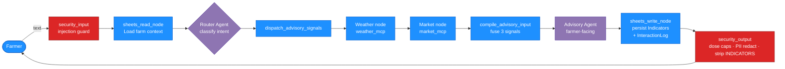

# CropPulse AI — Cross-Signal Intelligence for Smallholder Farmers


A multi-agent farming assistant built on **Google ADK 2.0** that fuses **live weather forecasts**, **commodity market prices**, and the farmer's own **farm-grid context** into a single, actionable recommendation. The farmer speaks with one voice — the **Advisory Agent** — while a directed graph of specialised agents and MCP-backed data nodes does the heavy lifting behind the scenes.

**Live deployment**: [croppulse-ai-459552199677.us-central1.run.app](https://croppulse-ai-459552199677.us-central1.run.app) · **Track**: Agents for Good.

---

## The Problem

- **16 million smallholder farms in Latin America** operate below one hectare, growing 30–40 % of the region's food supply (CEPAL, FAO 2023).
- **Crop losses of up to 60 %** from preventable diseases (Sigatoka on banana, Moniliasis on cacao, chlorosis on coffee) — losses that a timely, targeted intervention would avert (INIAP Ecuador, 2022).
- Agricultural intelligence exists — **weather forecasts, commodity prices, disease guides, extension-service manuals** — but each source is siloed, in a different language, and requires cross-referencing skills the average smallholder does not have time for.

The average farmer's decision — *"should I spray this week?"* — needs **multiple correlated signals** at once. Nobody puts them side by side in the field.

## The Solution

A **3-agent + 3-node** directed graph that fuses weather, market, and farm signals in one conversational turn:

| Signal | Node | Where the data comes from |
|---|---|---|
| **Weather** | `weather_node` → `weather_mcp` | Open-Meteo: current conditions, 7-day forecast, 14-day historical rainfall for leaching-risk. |
| **Market** | `market_node` → `market_mcp` | Date-seeded deterministic price generator for 8 commodities: spot + 30-day trend. |
| **Farm context** | `sheets_read_node` → `sheets_mcp` | Google Sheets — Profile, FarmGrid, CropPlan, Indicators, InteractionLog tabs. Falls back to an in-request `state_delta` envelope so onboarded data survives without a Sheet configured. |

All signals are stitched together by `compile_advisory_input` and rendered as farmer-facing prose by the single **Advisory Agent**. `security_screen` runs at the graph boundaries — PII redaction on outgoing text and dangerous-dosage guardrails on any agrochemical recommendation.

---

## Features

### 🌾 Farm Dashboard
- **Interactive parcel grid** — visual overview of all farm parcels with crop assignments (icons, colours, labels).
- **Add Parcel (+)** — click the dashed cell to add a new parcel using the same crop selection modal as onboarding.
- **Delete Parcel (−)** — each assigned parcel has a red minus button in the corner. Clicking it triggers a confirmation dialog before removing the parcel and all its data.
- **Tap-to-inspect** — click any parcel to filter the calendar and indicators to that parcel.
- **Real-time indicators** — health status, pending actions, weather conditions, and market prices updated after every AI interaction.

### 📅 Crop Planner & Calendar
- **Empty by default** — the calendar starts with no activities. Activities are only added when the user explicitly requests a plan via the AI Assistant.
- **One-click planning buttons** — three buttons next to the "Crop Planner" title:
  - 📅 **Generate Plan** — comprehensive crop planning schedule considering weather and market signals.
  - 💧 **Maintenance** — irrigation, fertilization, and maintenance activities for the current month.
  - 🐛 **Harvest & Pest** — harvest timeline and disease prevention schedule based on growth cycles.
- **Auto-redirect to AI** — clicking any plan button switches to the AI Assistant tab and auto-sends the planning prompt.
- **Save confirmation** — after the AI responds with recommended activities, a "Save X activities to your calendar?" prompt appears. Activities are added to the calendar **only after user confirmation**.
- **Full activity labels** — saved activities display their full text inside calendar day cells (not just dots), with a coloured left border matching the crop type.
- **Event list** — below the calendar, a detailed event list shows all activities with date, parcel, crop, and status badges (Scheduled / Pending / Completed / Overdue).

### 🤖 AI Assistant
- **Guided suggestions** — curated suggestion cards on the greeting screen that auto-send when clicked:
  - 🔔 Alert-driven actions (if pending actions exist)
  - 🌦️ Weather impact analysis
  - 💰 Market timing (sell recommendations)
  - 💚 Full farm health assessment
  - 🌾 Harvest readiness check
  - 🌱 Planting / weekly task recommendations
- **Follow-up pills** — after each response, contextual follow-up buttons chain the user to the next relevant agent signal they haven't asked about yet.
- **Dashboard sync** — AI responses containing `[INDICATORS]` blocks silently update the farm dashboard indicators, weather display, and market prices in real time.

### 🛡️ Security & Safety
- **Input validation** — truncation, prompt injection detection, PII redaction on all inputs.
- **Output guardrails** — dosage caps on agrochemical recommendations, low-confidence disclaimers, `[INDICATORS]` block stripping from user-visible responses.
- **Profile persistence** — farm profiles are saved to localStorage and optionally synced to Google Sheets for cross-device access.

### 🚀 Onboarding
- **3-step setup** — location selection → optional Google Sheets sync → parcel grid designer with crop picker and lifecycle stage.
- **Database toggle** — choose between local JSON fallback or live Google Sheets cloud sync.

---

## Architecture



**Why a directed graph, not a linear chain?**
- **Deterministic control flow**: security screens are anchored at START and END edges.
- **Sequential signal gathering**: weather → market → compile is chained so `compile_advisory_input` fires exactly once.
- **Shared state**: `ctx.state` accumulates `farm_context`, `weather_output`, `market_output`, `user_message` across nodes — no LLM sees another agent's raw prompt.

## Key ADK 2.0 concepts demonstrated

| Concept | Where it lives | Notes |
|---|---|---|
| **Multi-agent orchestration** via `Workflow(edges=[...])` | `workflow.py` | Directed graph — enforces security screens and conditional routing. |
| **Function nodes** side-by-side with LLM agents | `nodes/*.py` | `security_input_validation`, `sheets_read_node`, `weather_node`, `market_node`, `dispatch_advisory_signals`, `compile_advisory_input`, `sheets_write_node`, `security_output_validation`. |
| **Session state via `EventActions(state_delta=...)`** | `app.py` | `/run` accepts a client envelope and commits it through `session_service.append_event(...)` so the workflow starts with the farmer's real profile pre-loaded. |
| **MCP as data-access layer** | `mcp_servers/*.py` | Weather / Market / Sheets each expose FastMCP servers over stdio. Agents remain oblivious to underlying REST APIs. |

## Tech stack

- **Python 3.11+**, **Google ADK 2.0** (`google-adk[gcp]>=2.0`).
- **Gemini 2.5 Flash** via Vertex AI (`GOOGLE_GENAI_USE_VERTEXAI=true`).
- **3 MCP servers** using `mcp.server.fastmcp.FastMCP` (Weather / Market / Sheets).
- **FastAPI** wrapper on ADK's `get_fast_api_app` for the custom `/run`, `/api/market/validate-crop`, and static `/ui` mount.
- **Cloud Run** deploy (`Dockerfile` + `gcloud run deploy --source .`).
- **Google Sheets API v4** via `gspread` + **Application Default Credentials** (Cloud Run compute service account).
- **Frontend**: vanilla JS + HTML5, no framework, served as static files from `frontend/` under `/ui`.

## Setup

### Prerequisites

- Python 3.11+
- [`uv`](https://docs.astral.sh/uv/getting-started/installation/) package manager
- [Google Cloud SDK](https://cloud.google.com/sdk/docs/install) with a GCP project that has the **Vertex AI API** enabled (and the **Sheets API** if you want cross-device profile sync)
- `gcloud auth application-default login` completed once — locally this is how the Gemini calls (and optional Sheets writes) authenticate

### Install & run locally

```powershell
git clone https://github.com/dmyandun/croppulse-ai.git
cd croppulse-ai

# Install deps into a project-local venv
uv sync

# Copy env template and edit if needed
Copy-Item .env.example .env
# .env should contain:
#   GOOGLE_GENAI_USE_VERTEXAI=true
#   GOOGLE_CLOUD_PROJECT=<your-gcp-project>
#   GOOGLE_CLOUD_LOCATION=global

# Start the server
uv run uvicorn app:app --host 127.0.0.1 --port 8080
```

Open **http://127.0.0.1:8080/ui/index.html**. The onboarding flow — location → optional Sheets sync → parcel grid → dashboard — runs on first visit.

Alternative one-shot playground command (uses the same ADK entrypoint):

```powershell
uv run adk web croppulse-ai
```

### Deploy to Cloud Run

The `Dockerfile` uses `python:3.12-slim` + `uv sync --frozen`. A single `gcloud run deploy` builds via Cloud Build, pushes to Artifact Registry, and rolls out:

```powershell
gcloud run deploy croppulse-ai `
  --source . `
  --region=us-central1 `
  --allow-unauthenticated `
  --memory 1Gi `
  --set-env-vars "GOOGLE_GENAI_USE_VERTEXAI=true,GOOGLE_CLOUD_PROJECT=<your-project>,GOOGLE_CLOUD_LOCATION=global"
```

The service uses the default Cloud Run compute service account for both Vertex AI and Google Sheets — no service-account-JSON file needed. If you want Sheets writes, **share your Sheet with the compute SA** shown in the onboarding UI.

## Project structure

```
croppulse-ai/
├── app.py                   # FastAPI + Runner. /run accepts state_delta envelope.
├── workflow.py              # Directed graph: 3 agents + function nodes.
│
├── agents/
│   ├── router_agent.py      # Intent classification → JSON {intent, confidence}
│   ├── advisory_agent.py    # ONLY farmer-facing agent. Fuses weather+market+farm signals.
│   ├── weather_agent.py     # Reserved. Weather is currently fetched via weather_node.
│   └── market_agent.py      # Reserved. Market is fetched via market_node.
│
├── nodes/
│   ├── security_screen.py   # Input: PII redact, injection guard.
│   │                        # Output: dosage cap, low-confidence disclaimer, [INDICATORS] strip.
│   ├── sheets_manager.py    # sheets_read_node (loads farm_context) + sheets_write_node (persists Indicators + InteractionLog).
│   ├── weather_node.py      # MCP client → 3 Open-Meteo tools (current, forecast, historical rain).
│   └── market_node.py       # MCP client → get_current_price + get_price_trend per crop.
│
├── mcp_servers/
│   ├── weather_mcp.py       # Open-Meteo wrapper. No auth needed.
│   ├── market_mcp.py        # Deterministic per-date price generator. 8 commodities.
│   └── sheets_mcp.py        # gspread + ADC → Google Sheets. Falls back to crop_logs.json mock.
│
├── frontend/
│   ├── index.html           # 3-step onboarding + tabbed dashboard (Farm / AI).
│   ├── app.js               # State, agentRun envelope, renderFarmGrid, chat, crop modal,
│   │                        # calendar rendering, parsePlanActivities, save confirmation.
│   └── styles.css           # Dark theme, glassmorphism, calendar labels, plan buttons.
│
├── tests/
│   ├── unit/                # Focused: security_screen, workflow-graph shape.
│   ├── integration/         # Runner + InMemorySessionService end-to-end.
│   └── eval/                # Agent-quality metrics.
│
├── Dockerfile               # python:3.12-slim + uv sync --frozen
├── pyproject.toml
├── uv.lock
└── .env.example
```

## MCP servers

### `weather_mcp.py`
Read-only, no credentials. Three tools:
- `get_current_weather(latitude, longitude, location_name)` → temp, humidity, weather-code.
- `get_7day_forecast(...)` → per-day precipitation + max/min temperature.
- `get_historical_rain(..., days_back=14)` → aggregated precipitation for leaching-risk scoring.

Data source: **Open-Meteo** (`api.open-meteo.com`) — free, no key.

### `market_mcp.py`
Read-only, deterministic. Per-date seeded generator so integration tests produce repeatable prices. Commodities: `cacao, banana, coffee, palm_oil, rice, maize, plantain, cassava`. Tools:
- `get_current_price(crop)` → spot USD/tonne, daily change %, trend direction.
- `get_price_trend(crop, days=30)` → 30-day time series.

### `sheets_mcp.py`
Read + write. Auth priority:
1. `GOOGLE_SERVICE_ACCOUNT_JSON` env → file path.
2. `GOOGLE_SHEETS_CREDENTIALS_JSON` env → inline JSON.
3. **Application Default Credentials** → Cloud Run compute SA is picked up automatically without any env config.

Tabs: `Profile`, `FarmGrid`, `CropPlan`, `Indicators`, `InteractionLog`. When no `sheet_id` is provided or ADC is unavailable, falls back to a local `crop_logs.json` mock so local development still exercises the write path.

## Screenshots

*(to be added — placeholders)*

- **Onboarding — Step 1**: Location selectors (country / province / canton).
- **Onboarding — Step 2**: Google Sheets sync (optional, with copy-to-clipboard SA email).
- **Onboarding — Step 3**: Farm-grid designer with crop picker and lifecycle stage selector.
- **Farm Dashboard**: Parcel grid with add (+) and delete (−) controls, health indicators, weather, and market prices.
- **Crop Planner**: Empty calendar with plan generation buttons. Full activity labels appear after AI-generated plan is confirmed.
- **AI Assistant**: Suggestion cards, follow-up pills, and calendar save confirmation flow.

## Roadmap / future work

- **Voice input & output** — Gemini Live so farmers can query the assistant hands-free in the field.
- **Vision agent (re-integration)** — multimodal crop/disease analysis from photos, currently removed pending improved accuracy.
- **Community knowledge sharing** — a cooperative Google Sheet where nearby farmers share disease reports; disease-diagnosis agent could correlate outbreaks across neighbours.
- **Government extension service integration** — direct-line MCPs to INIAP (Ecuador), Agrosavia (Colombia), INIA (Peru) so agent recommendations link to the local, certified guidance.
- **Satellite imagery** — Sentinel-2 NDVI overlays per parcel, complementing on-the-ground diagnostics.
- **Offline-first PWA** — the current UI is mostly client-side already; a service worker + cached MCP responses would let the app function during rural connectivity drops.
- **Native Spanish / Portuguese / Quechua responses** — the model handles it but instructions and disclaimers are still English-first.

## Observability

Built-in ADK telemetry exports to **Cloud Trace**, **BigQuery**, and **Cloud Logging**. Response-time budgets and per-node latency are visible in the Cloud Run revisions dashboard.

## License

Apache-2.0 — see individual file headers.
